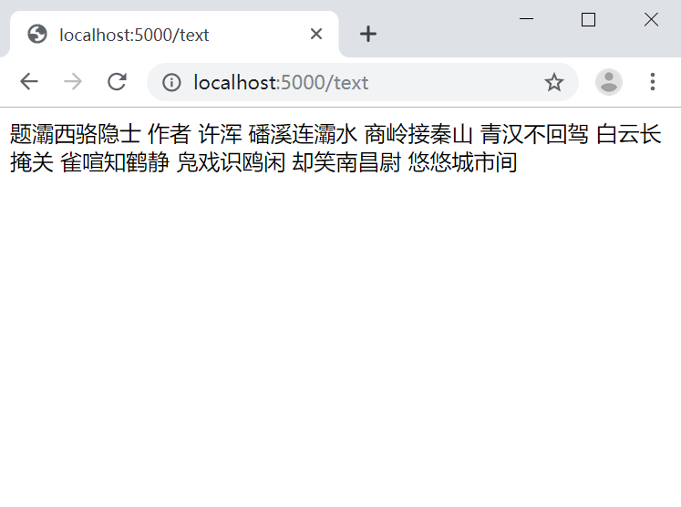
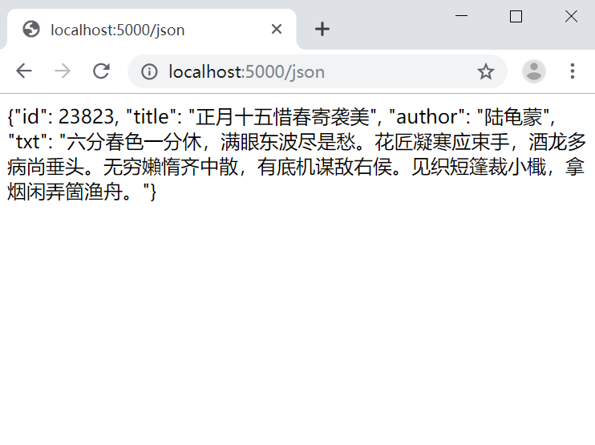
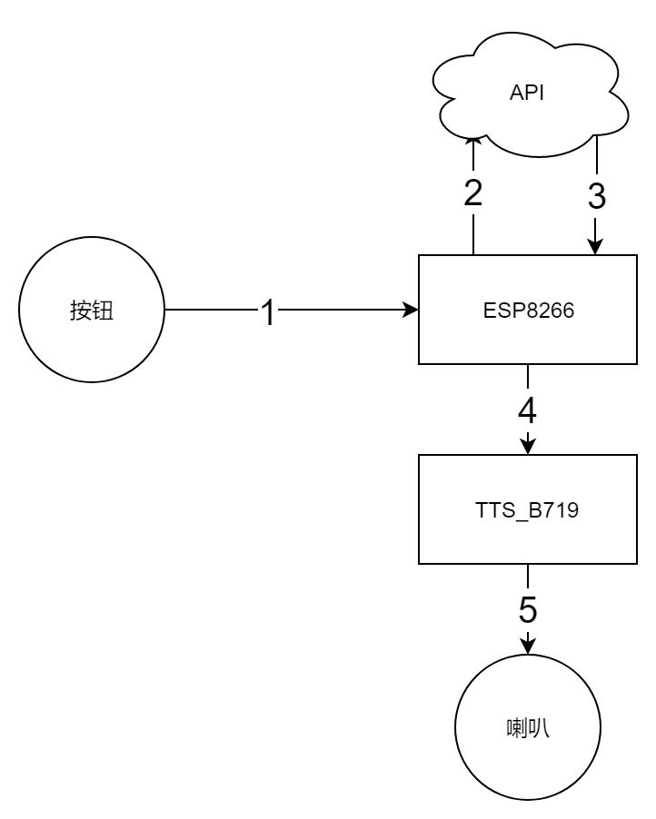

### 随机唐诗按钮

按一下，就能随机读一首唐诗。


所需材料：

1. ESP8266
2. TTS串口文字转语音模块
3. 扬声器
4. 数字按钮

所需工具：

1. 电烙铁
2. windows 10 PC电脑

所需软件：

1. arduino
2. python3


使用别人的项目及代码：

1. 唐诗数据库

   https://github.com/chinese-poetry/chinese-poetry/tree/master/json

2. json到sqlite转换工具

   https://github.com/animalize/QuanTangshi/blob/master/tools/ok_make_db.py

   这是一个安卓项目，作者提供了一个转换工具。我在其基础上增加了繁体转简体。以及删掉了标题、内容中包含括号、书名号等字符的诗。

3. 繁体转简体

   https://github.com/skydark/nstools/tree/master/zhtools

4. flask框架

   https://palletsprojects.com/p/flask/

   API部分使用flask框架。


克隆本项目，进入 api/json2sqlite 目录，执行 python3 get.py 把json数据库转为sqlite。

然后到api目录，执行 python3 web.py 开启服务。

```
git clone https://github.com/my-products/tangshi.git
cd tangshi
cd api
cd json2sqlite
python3 get.py
cd ..
python3 web.py
```

访问 http://localhost:5000/text 可以随机获得一首唐诗。



访问 http://localhost:5000/json 可以随机获得一首唐诗（json格式）



流程




arduino 部分


安装 wifimanager 库，搜索 wifimanager tzapu


