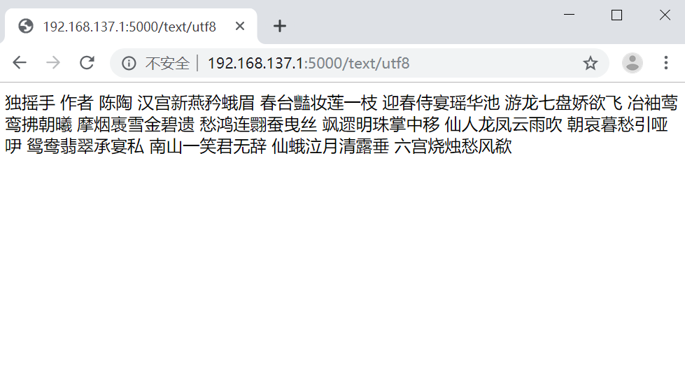
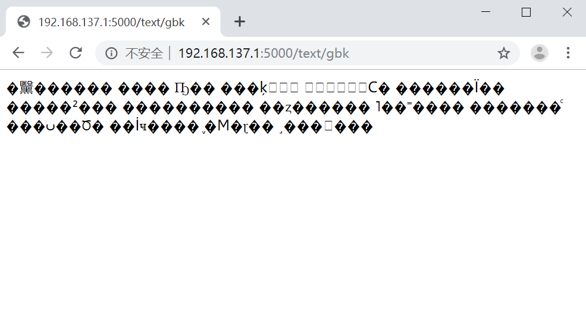

## 随机唐诗按钮

按一下，就能随机读一首唐诗。

### 需要准备的

**所需材料：**

1. ESP8266

2. TTS串口文字转语音模块

   

3. 扬声器

4. 按钮

**所需工具：**

1. 电烙铁
2. windows 10 PC电脑

**所需软件：**

1. arduino
2. python3


### 引用他人代码


本项目使用了如下项目及代码：

1. 唐诗数据库

   https://github.com/chinese-poetry/chinese-poetry/tree/master/json

2. json到sqlite转换工具

   https://github.com/animalize/QuanTangshi/blob/master/tools/ok_make_db.py

   这是一个安卓项目，作者提供了一个转换工具。我在其基础上增加了繁体转简体。以及删掉了标题、内容中包含括号、书名号等字符的诗。

3. 繁体转简体

   https://github.com/skydark/nstools/tree/master/zhtools

4. flask框架

   https://palletsprojects.com/p/flask/

   API部分使用flask框架。
   
5. arduino 的 esp8266 支持库 

   在arduino的首选项中，增加如下内容：

   ```
   https://arduino.esp8266.com/stable/package_esp8266com_index.json
   ```

   打开开发板管理器，搜索esp8266并安装。

   

6. wifimanager 

   能让arduino方便配网的库。可自定义热点名称。连接后输入192.168.4.1进行配网，从而让esp8266可以联网。

   打开库管理器，搜索wifimanager tzapu，按照下图所示，点击安装。

   

   

### 项目实施

克隆本项目，进入 api/json2sqlite 目录，执行 python3 get.py 把json数据库转为sqlite。

然后到api目录，执行 python3 web.py 开启服务。

```
git clone https://github.com/my-products/tangshi.git
cd tangshi
cd api
cd json2sqlite
python3 get.py
cd ..
python3 web.py
```


访问 http://localhost:5000/json 可以随机获得一首唐诗（json格式）


为了方便语音合成，还可以访问 http://localhost:5000/text/utf8 随机获得一首唐诗（纯文本格式）。


使用arduino打开目录arduino\tangshi，tangshi.ino是源代码。打开后直接使用arduino烧录即可。

如果你懒得打开那个文件，这里直接粘贴出源码：

```

#include <ESP8266WiFi.h>
#include <DNSServer.h>
#include <ESP8266WebServer.h>
#include <WiFiManager.h>
#include <ESP8266HTTPClient.h>

WiFiManager wifiManager;
HTTPClient http;
const unsigned long HTTP_TIMEOUT = 5000;
int buttonState = 0;
String response;
int button_pin = D4;//触发按钮
char const *ap_name = "TangshiAP";//ap name
boolean debug_mode = false;//debug?
String debug_wifi_name = "chinaunion";
String debug_wifi_pass = "chinaunion";
//由于tts语音模块需要ansi编码。故，每次串口输出都需经过转码。可用python3的.encode("gbk")来实现

void setup() {
  //  Serial.swap();//调用映射方法GPIO1(TX),GPIO3(RX)   不调用，同样可用，因为是 TX0/RX0。调用后，arduino监控台无输出。
  pinMode(button_pin, INPUT_PULLUP);
  if (debug_mode) {
    WiFi.mode(WIFI_STA);
    WiFi.begin(debug_wifi_name, debug_wifi_pass);
    WiFi.setAutoConnect(true);
  } else {
    wifiManager.autoConnect(ap_name);
  }
  while (WiFi.status() != WL_CONNECTED) {
    delay(1000);
  }
  Serial.begin(9600);
  Serial.println("\xcd\xf8\xc2\xe7\xc1\xac\xbd\xd3\xb3\xc9\xb9\xa6");//网络连接成功
  http.begin("http://106.12.133.66:5000/text/gbk");
  http.setTimeout(HTTP_TIMEOUT);
  http.setUserAgent("esp8266");//用户代理版本
  //  http.setAuthorization("esp8266","123456");//用户校验信息
}

void loop() {
  buttonState = digitalRead(button_pin);
  if (buttonState == LOW) {
    Serial.printf("\xd5\xfd\xd4\xda\xc7\xeb\xc7\xf3 API");//正在请求API
    int httpCode = http.GET();
    Serial.println(httpCode);
    if (httpCode == HTTP_CODE_OK) {
      response = http.getString();
      Serial.println(response);//输出内容
    } else {
      Serial.printf("API \xc1\xac\xbd\xd3\xca\xa7\xb0\xdc");//API连接失败
    }
    http.end();
    delay(5000);
  }
}
```

tangshi.ino.nodemcu.bin 是生成的二进制。如果你想直接用，可以使用esp8266的烧录工具直接烧录。烧录地址，0x00。烧录工具：乐鑫官方地址下载https://www.espressif.com/sites/default/files/tools/flash_download_tools_v3.6.7.zip

直接使用乐鑫烧录时，需要注意的是，在需要做配置的地方，参考arduino的参数即可：


该固件中，API调用的http://106.12.133.66:5000/text/gbk是我临时的服务器地址，没准儿什么时候会停止，所以建议大家还是使用自己的API。

### 坑

然而，utf8格式的文本，tts语音合成模块竟然不认。去卖家店铺看了一下详细说明，发现这个模块支持的是ansi编码。

解决的方法有两种，可以在arduino上面让tts模块读出汉字。

**方法1**

ino源文件以ansi编码保存。

这种方法不好。arduino再编辑，又是utf8格式的。除非你每次烧录前用记事本保存为ansi格式，使用arduino别点击保存，直接烧录。

**方法2**

输出ansi编码给串口。
使用python3，在控制台可以通过.encode("ansi")进行转换。但是，linux下似乎无效，提示找不到这个ansi编码。在linux下，可以使用.encode("gbk")来获得ansi字符。

所以，API也提供了ansi和gbk两种方式调用。
如访问 http://localhost:5000/text/gbk 随机获得一首唐诗（gbk格式）。


### 流程

按钮会触发一个低电平，ESP8266得到这个触发事件，去调用API获得一首随机唐诗，直接给转到串口，这时TTS就工作了。


### 硬件连接

ESP8266的针脚如图所示：


TTS_B719的背面很清晰，按照标识连接即可。黄色框选处连接TTS_B719的电源，红色框选处连接TTS_B719的串口。蓝色框选处连接按钮。


需要注意的是：
1. ESP8266的TX要连接TTS_B719的RX。ESP8266的RX要连接TTS_B719的TX。

2. 按钮是低电平触发，按钮焊接D4和ESP8266上随便找个GND即可。


### 演示

https://github.com/my-products/tangshi/raw/master/readme-images/demo.mp4


最后，千万别用这玩意儿，破声音，听着头疼。